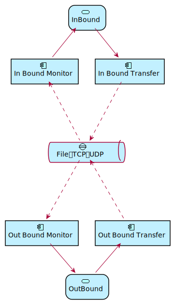

# hgap

`HGAP`是一个Http反向代理，支持以文件同步、单向UDP、单向TCP作为中间的传输方式。`HGAP`主要用于网闸设备的Http协议穿透，或用于其它只支持单向数据传输的场景。`HGAP`的单个执行文件包含了隔离设备两端的服务程序。程序采用 Go 语言编写。



### 基本概念

 - `InBound`入站端：是Http请求代理的入口，用于在隔离设备的一侧接收Http请求。接收到请求后，`InBound`将请求交给`Transfer`传输至`Outbound`端。

 - `OutBound`出站端：用于在隔离设备的另一侧执行Http请求。请求处理完成后，`OutBound`将响应数据交给`Transfer`传输到`InBound`端。

 - `Transfer`传输对象：用于在隔离设备的两侧传输数据。目前支持的传输方式有`file`、`udp`、`tcp`。

 - `Monitor`数据监控对象：用于监控`Transfer`对象传输过来的数据帧，当请求或响应数据收集完整后，通知`InBound`和`Outbound`进行处理。

### 基本使用

```
  Usage: hgap [command]
  Commands:
    inbound - run as inbound server mode
    outbound - run as outbound server mode
```

### 配置说明

`HGAP`的配置文件为`config.json`，其格式如下：

```json
{
    "timeout": 30000,
    "port": 9090,
    "fileCheckInterval": 20,
    "fileScanInterval": 200,
    "keepFiles": false,
    "encrpt": false,
    "inDirectory": "in/req",
    "outDirectory": "out/resp",
    "inTextTransfer": false,
    "outTextTransfer": false,
    "inTransferType": "tcp",
    "outTransferType": "tcp",
    "inMonitorHost":  "0.0.0.0",
	"inMonitorPort":  9091,
	"outMonitorHost": "0.0.0.0",
    "outMonitorPort": 9092,
    "log":{
        "level": "debug"
    },
    "urlMapping": {
        "/test": "http://localhost:3005/index.html",
        "/": "https://cn.bing.com/"
    }
}
```

 - timeout 超时时间，`InBound`端的Http超时时间，`OutBound`端的Http请求超时时间都由timeout参数设置。

 - port Http反向代理服务端口。

 - fileCheckInterval 当使用`file`类型的`Transfer`时，检查单个请求或响应文件是否写入完成的时间间隔，单位为毫秒。

 - fileScanInterval 当使用`file`类型的`Transfer`时，`Monitor`扫描文件目录的时间间隔，单位为毫秒。

 - keepFiles `file`传输模式下，是否删除传输的文件（仅供调试）。

 - encrypt 对传输的数据进行加密（未处理）。

 - inDirectory `file`传输模式下，`InBound`端文件写入目录。

 - outDirectory `file`传输模式下，`OutBound`端文件写入目录。

 - inTextTransfer `InBound`端采用纯文本(Base64)方式向`OutBound`端发送数据。

 - outTextTransfer `OutBound`端采用纯文本(Base64)方式向`InBound`端发送数据。

 - inTransferType `InBound`端向`OutBound`端发送数据采用的传输方式：支持`file`、`udp`、`tcp`。

 - outTransferType `OutBound`端向`InBound`端发送数据采用的传输方式：支持`file`、`udp`、`tcp`。

 - inMonitorHost `InBound`端使用`udp`或`tcp`等网络传输方式时，`InBound`端的`Monitor`对象的监听主机。

 - outMonitorHost `OutBound`端使用`udp`或`tcp`等网络传输方式时，`OutBound`端的`Monitor`对象的监听主机。

 - inMonitorPort `InBound`端使用`udp`或`tcp`等网络传输方式时，`InBound`端的`Monitor`对象的监听端口。

 - outMonitorHost `OutBound`端使用`udp`或`tcp`等网络传输方式时，`OutBound`端的`Monitor`对象的监听端口。 

 - urlMapping `OutBound`端执行请求时的URL映射规则，请求URI中匹配`urlMapping`左侧的内容将被替换成`urlMapping`中右侧的内容。

 - log 日志配置
    
    - output 支持`stdout,file`的形式，表示同时输出至标准输出和文件。

    - rotate 是否启用日志文件滚动输出。

    - file 日志文件名前缀，可包含路径。

    - maxAge 日志文件保存时长，单位为分钟。

    - rotationTime 日志滚动时间间隔，单位为分钟。

    - level 日志输出级别。
